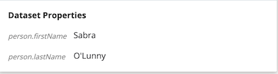
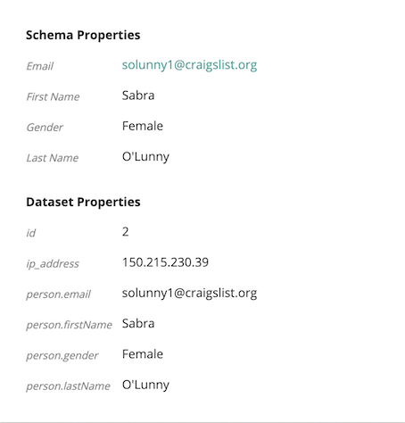

# Widgets provided by the framework
This list is a work in progress, speak to someone from the CluedIn UI team for more information:

## EntityPropertyList
EntityPropertyList is for displaying the properties of an entity in a list, with default formatting for different value types.

By default, it will display all properties of an entity, split into two parts - properties from the schema and properties from the dataset. If you don't want to see all the properties, you can use the `vocabularyKeys` parameter to define a list of properties that should be shown.

#### Example usage
```js
widgets: [
    {
      name: 'EntityPropertyList',
      place: 'property',
      parameters: JSON.stringify({
        vocabularyKeys: [
          'person.firstName',
          'person.lastName',
        ],
      }),
      onlyAdmin: false,
    },
];
```

#### With vocabularyKeys


#### Default display

